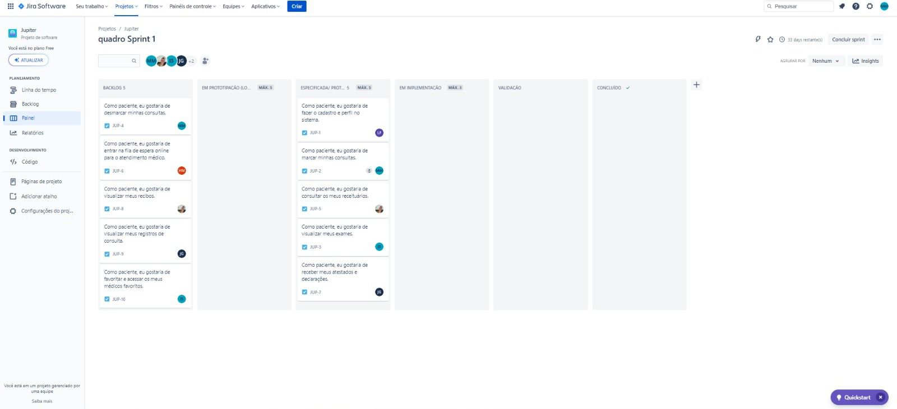
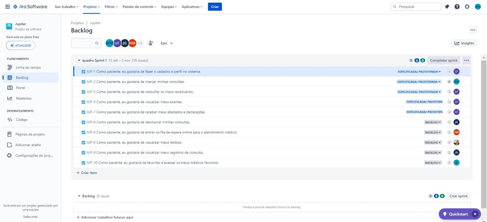

<h1>💫 Jupiter 💫</h1>

<h2>Descrição</h2>

> Este é um Projeto da disciplina de Fundamentos de Desenvolvimento de Software em que criamos um aplicativo que visa otimizar a gestão de consultórios médicos, proporcionar um atendimento mais eficiente e melhorar a experiência tanto dos profissionais de saúde quanto dos pacientes. Apresentamos o aplicativo de gerenciamento de consultórios "Jupiter" – onde a excelência encontra o cuidado inspirado por Júpiter, o maior planeta do sistema solar.

<h2>Colaboradores</h2>

<a href="https://github.com/Henrique-12345">Henrique Magalhães</a> | hlm2@cesar.school

<a href="https://github.com/igorfwds">Igor Wanderley</a> | Ifws@cesar.school

<a href="https://github.com/JoaovfGoncalves">João Victor Ferraz</a> | jvfg@cesar.school

<a href="https://github.com/lizandravieira">Lizandra Vieira</a> | lmsvf@cesar.school

<a href="https://github.com/mjuliamenezes">Maria Júlia Menezes</a> | mjotm@cesar.school

<a href="https://github.com/Tiagopbc">Tiago Cavalcanti</a> | tpbc@cesar.school

<h2>Links Importantes</h2>

<a href="https://tpbc.atlassian.net/jira/software/projects/JUP/boards/2">Link do Jira </a>

<a href="https://www.figma.com/file/Hdcw3afQND6NQS8Uqp3Q7a/Lo-fi-JUPITER?type=design&node-id=1426-2107&mode=design&t=Vlbn0e5q0l2CSaMy-0">Link do protótipo lo-fi no figma</a>

<h2>Primeira Entrega 📦</h2>

<a href="https://www.youtube.com/watch?v=d9tIOqOFgMM">ScreenCast - Protótipo</a>

Quadro de Sprint no Jira:

Quadro Backlog no Jira:

