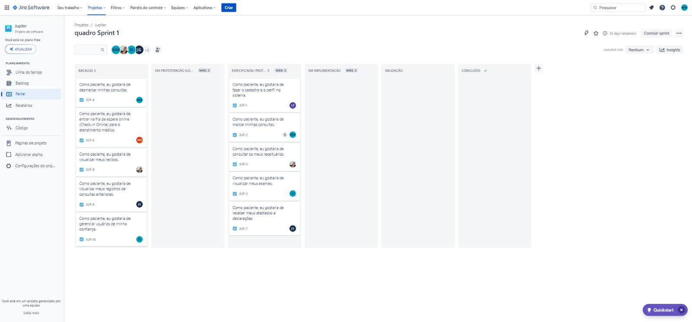
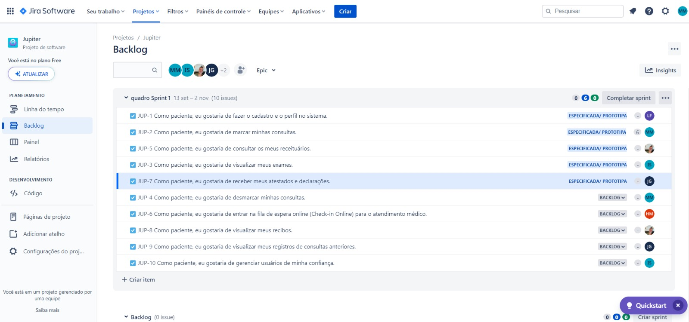
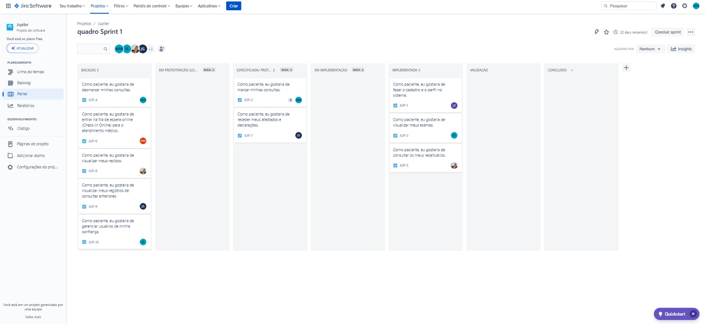
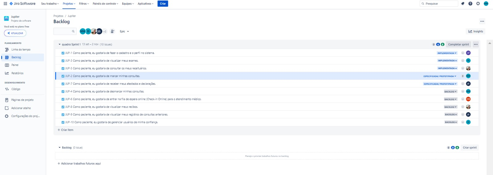
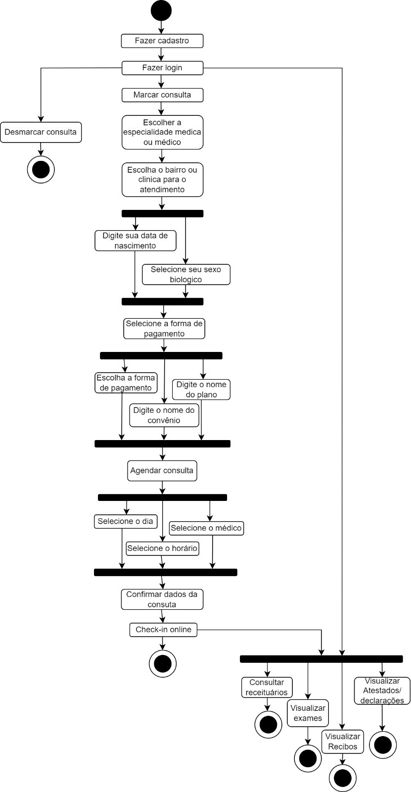
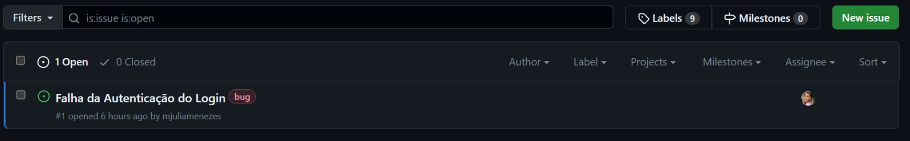

<h1>💫 Jupiter 💫</h1>

<h2>Descrição</h2>

> Este é um Projeto da disciplina de Fundamentos de Desenvolvimento de Software em que criamos um aplicativo que visa otimizar a gestão de consultórios médicos, proporcionar um atendimento mais eficiente e melhorar a experiência tanto dos profissionais de saúde quanto dos pacientes. Apresentamos o aplicativo de gerenciamento de consultórios "Jupiter" – onde a excelência encontra o cuidado inspirado por Júpiter, o maior planeta do sistema solar.

<h2>Colaboradores</h2>

<a href="https://github.com/Henrique-12345">Henrique Magalhães</a> | hlm2@cesar.school

<a href="https://github.com/igorfwds">Igor Wanderley</a> | Ifws@cesar.school

<a href="https://github.com/JoaovfGoncalves">João Victor Ferraz</a> | jvfg@cesar.school

<a href="https://github.com/lizandravieira">Lizandra Vieira</a> | lmsvf@cesar.school

<a href="https://github.com/mjuliamenezes">Maria Júlia Menezes</a> | mjotm@cesar.school

<a href="https://github.com/Tiagopbc">Tiago Cavalcanti</a> | tpbc@cesar.school

<h2>Links Importantes</h2>

<a href="https://tpbc.atlassian.net/jira/software/projects/JUP/boards/2">Link do Jira </a>

<a href="https://www.figma.com/file/Hdcw3afQND6NQS8Uqp3Q7a/Lo-fi-JUPITER?type=design&node-id=1426-2107&mode=design&t=Vlbn0e5q0l2CSaMy-0">Link do protótipo lo-fi no figma</a>

<h2>Primeira Entrega 📦</h2>

<a href="https://www.youtube.com/watch?v=d9tIOqOFgMM">ScreenCast - Protótipo</a>

<h3 align="center">Quadro de Sprint no Jira:</h3>

<h3 align="center">Quadro Backlog no Jira:</h3>

<h2>Segunda Entrega 📦</h2>

<h3 align="center">Deploy:</h3>

Instruções de acesso: Ao acessar a Tela Inicial do Sistema, o usuário tem duas opções disponíveis. Ele pode optar por fazer login, caso já tenha uma conta registrada, ou realizar o Cadastro no Sistema. Uma vez logado, na Tela de Serviços do Usuário, ele terá acesso à visualização de exames e receituários.

<h3 align="center">Relato Pair Programming</h3>

Usando o método de Pair Programming, foram compreendidas as vantagens que o sistema oferece e, também, foram identificados erros e desafios ao longo do percurso. Realizando pequenas revisões, foram efetuadas as modificações necessárias para manter o projeto em andamento e seguir o fluxo. Essa abordagem de trabalho fortaleceu as relações profissionais entre os membros, o compartilhamento de conhecimento e experiências se mostrou um diferencial, reduzindo a dependência de um único integrante e enriquecendo as decisões com a contribuição de duas perspectivas diferentes. No decorrer desse processo, foram observados, também, detalhes sobre os papéis de "condutor" e "navegador", sendo possível aprimorar a comunicação entre os membros e a alternância de papéis, permitindo que cada integrante atuasse como condutor em um momento e como navegador em outro. Foi percebido que a programação em pares não é apenas uma técnica eficaz, mas também uma valiosa oportunidade de aprendizado e desenvolvimento.

<h3 align="center">Quadro de Sprint no Jira:</h3>

<h3 align="center">Quadro Backlog no Jira:</h3>

<h3 align="center">Diagrama de Atividades:</h3>

<h3 align="center">Issue/Bug Tracker:</h3>
